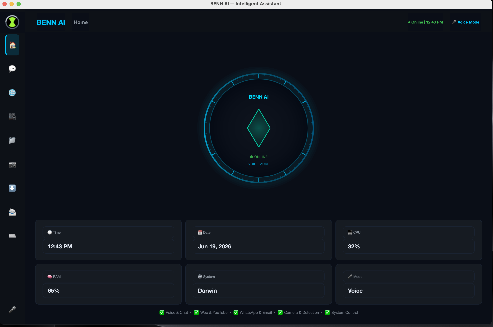
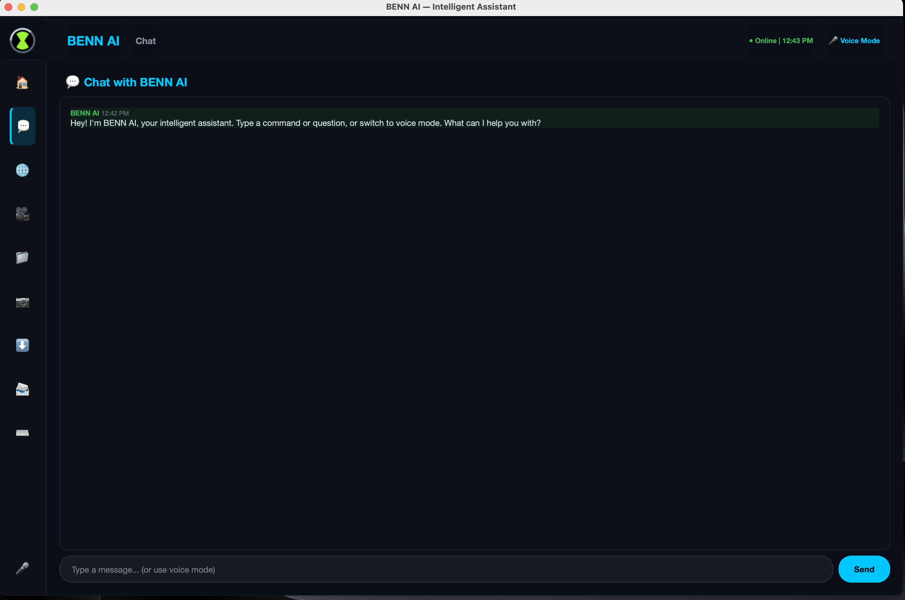
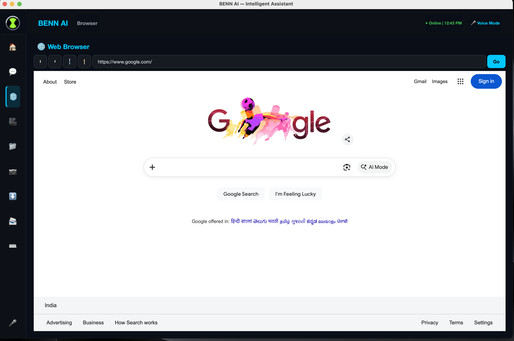
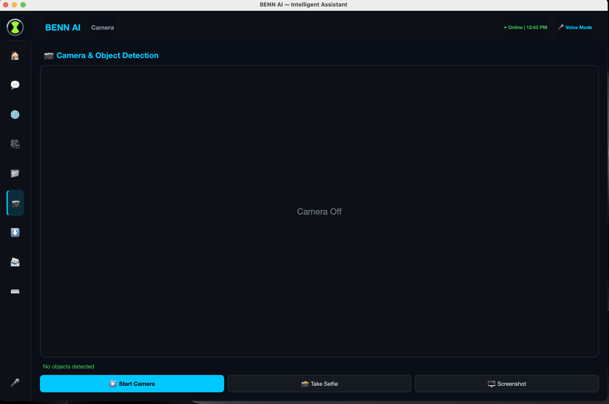
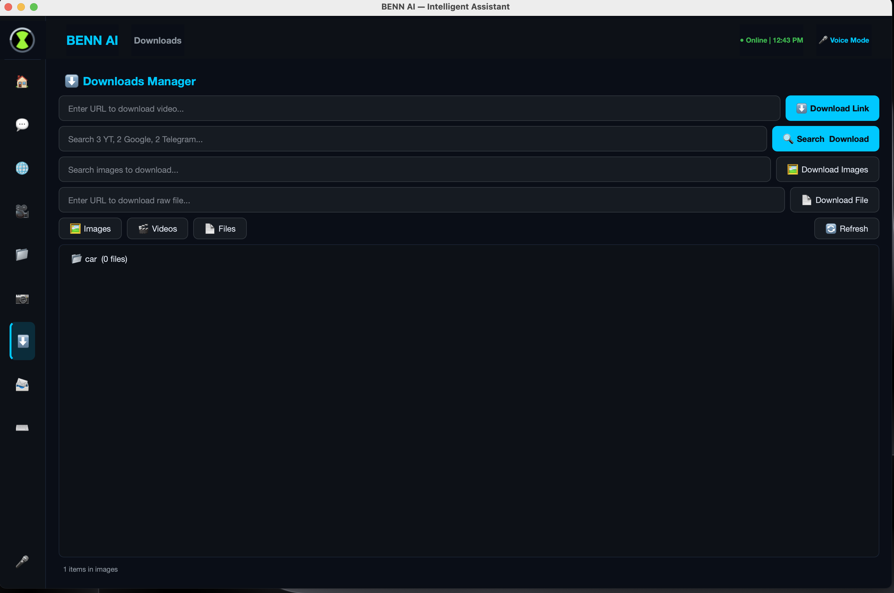
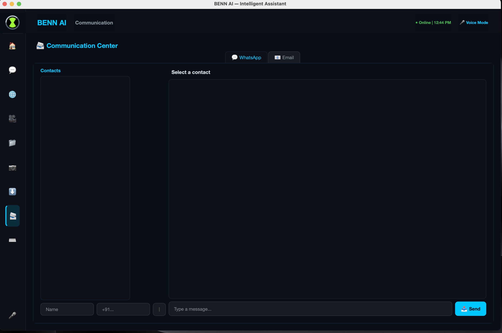
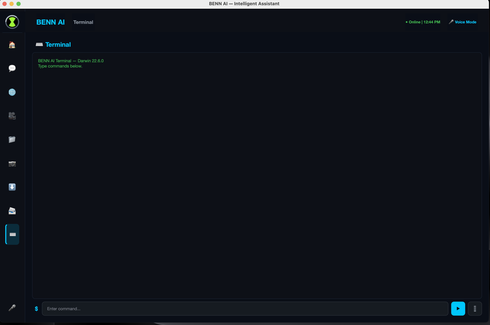

<!DOCTYPE html>
<html lang="en">
<head>
<meta charset="UTF-8">
<meta name="viewport" content="width=device-width, initial-scale=1.0">
<title>BEN AI Voice Assistant</title>
</head>
<body>

    <h1>🤖 BEN AI Voice Assistant</h1>
    

        An intelligent Python-based AI assistant inspired by the Omnitrix,
        featuring voice recognition, automation, memory management,
        gesture control, and a futuristic user interface.
    

<h2>📖 Overview</h2>

BEN AI is a powerful personal voice assistant built with Python.
It combines speech recognition, natural voice responses, automation,
computer vision, and intelligent interaction to provide a seamless
hands-free experience.

<h2>✨ Features</h2>

<ul>
    <li>🎤 Real-Time Voice Recognition</li>
    <li>🔊 Natural Text-to-Speech Responses</li>
    <li>🧠 Intelligent Memory Management</li>
    <li>⚡ System & Application Automation</li>
    <li>🖐️ Gesture Control using OpenCV & MediaPipe</li>
    <li>🌐 Website & Application Launcher</li>
    <li>💬 Interactive AI Conversations</li>
    <li>🎨 Omnitrix-Inspired Modern GUI</li>
    <li>🔧 Modular & Scalable Architecture</li>
</ul>

<h2>🛠️ Technology Stack</h2>

<ul>
    <li>Python</li>
    <li>PyQt6</li>
    <li>Faster-Whisper</li>
    <li>Edge-TTS</li>
    <li>OpenCV</li>
    <li>MediaPipe</li>
    <li>Pygame</li>
    <li>SoundDevice</li>
    <li>SQLite</li>
</ul>

<h2>📸 Screenshots</h2>

      
      
      
      
      
      
    

<h2>🚀 Installation</h2>

<h3>Clone Repository</h3>

<pre>
git clone https://github.com/shaik707/Ben-AI-Voice-Assistant-.git
cd Ben-AI-Voice-Assistant-
</pre>

<h3>Create Virtual Environment</h3>

<pre>
python -m venv venv
</pre>

<h3>Activate Virtual Environment</h3>

<b>Windows</b>

<pre>
venv\Scripts\activate
</pre>

<b>Linux / macOS</b>

<pre>
source venv/bin/activate
</pre>

<h3>Install Dependencies</h3>

<pre>
pip install -r requirements.txt
</pre>

<h3>Run BEN AI</h3>

<pre>
python main.py
</pre>

<h2>🎯 Project Goals</h2>

<ul>
    <li>Build a futuristic AI assistant.</li>
    <li>Provide voice-controlled automation.</li>
    <li>Create an Omnitrix-inspired user experience.</li>
    <li>Enable easy expansion and future AI integrations.</li>
</ul>

<h2>📄 License</h2>

This project is developed for educational, research, and personal productivity purposes.

</body>
</html>

